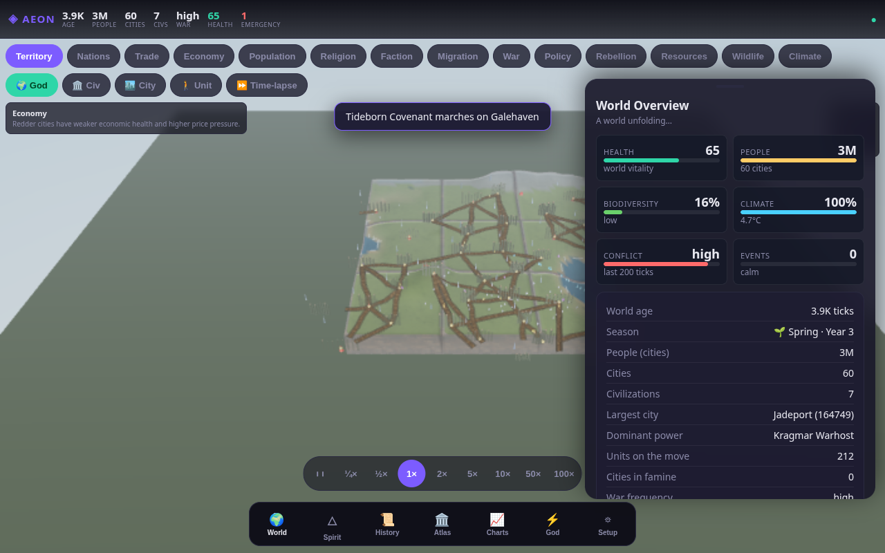
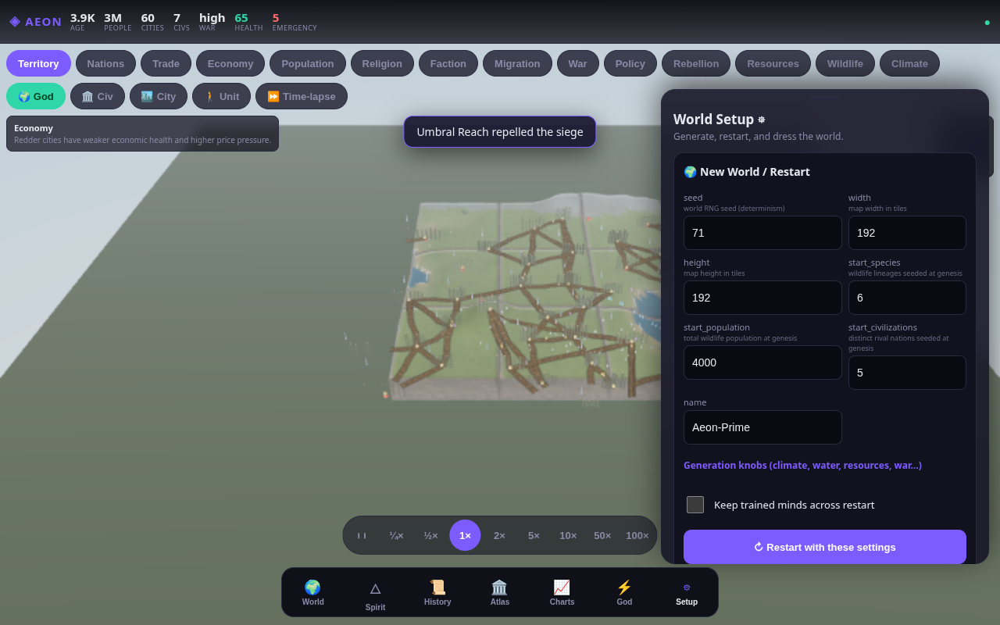
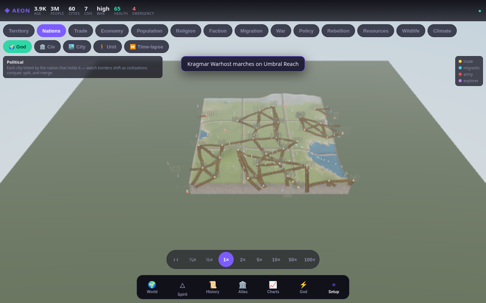
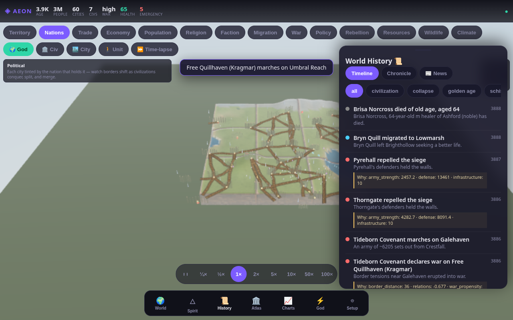

# AEON: Living Worlds

> A browser-based living world simulation where civilizations rise, fracture, migrate,
> starve, worship, fight, remember, and evolve.

AEON is an experimental **living-world sandbox**. A fast, deterministic simulation runs
the terrain, climate, ecology, cities, economy, and wars; thousands of **real, persistent
citizens** live inside the cities with personalities, memories, beliefs, and grievances;
**religions and factions emerge** from those beliefs and go on to schism, spread, and
overthrow states; and an optional local LLM acts as a **world-spirit** that bends the
rules (never the outcomes) and narrates the unfolding history into a **Chronicle**. You
watch and steer it all from a real-time 3D dashboard built mobile-first.

**▶ [Watch a real AEON world run in your browser](https://yandesbiens.com/projects/aeon)** — a
recorded world replaying live in the actual renderer, no install. If it's your kind of thing:
⭐ star the repo, and [follow the lab](https://yandesbiens.com/newsletter/) for one short email
per proof drop (no spam).

> ⚠️ **This is an experimental prototype, not a finished game.** Sim balance, AI systems,
> and save formats are all evolving. The goal is a world that becomes stranger, richer,
> and more storied over time — one you open "for five minutes" and look up three hours
> later, invested in a fictional dynasty. See [Known Limitations](docs/KNOWN_LIMITATIONS.md).

---

## ⚡ Part of an open, local-first research program

AEON is one project from **[Éthiqueia](https://yandesbiens.com)** — my independent AI
research lab. Solo, local-first, on a single RTX 4090, in Saguenay. The lab ships **proof
drops**: small, reproducible benchmarks with the code, the numbers, *and* the honest failure
case. If AEON's no-cloud, run-it-yourself stance is your thing, the rigorously benchmarked
side of the lab is probably your speed too:

- 🧠 **[UFM](https://github.com/Linutesto/ufm)** — run a model *larger than your VRAM* on a
  single GPU. ~240× faster than naive offload; honest no-locality failure case.
  → [benchmark writeup](https://yandesbiens.com/blog/ufm-benchmark/)
- 🌳 **[FMM](https://github.com/Linutesto/fmm)** — memory that pages itself: topic-scoped
  retrieval, and a near-free router that recovers ~98% of oracle recall at ~60× flat-scan
  speed. → [benchmark writeup](https://yandesbiens.com/blog/fmm-router/)

**→ Follow the work:** [the lab](https://yandesbiens.com) ·
[newsletter](https://yandesbiens.com/newsletter/) — one short email per proof drop, no spam ·
[the full research map](https://yandesbiens.com/research/)

*AEON is the world-model corner of that program — framed as engineering, not a claim.*

---

## 1. What is AEON?

AEON couples a **deterministic Tier-0 simulation** (the source of truth for every
outcome) with optional higher "intelligence tiers" that only *interpret* or *nudge* that
truth:

- The **sim** (`aeon/sim/`) owns terrain, climate, resources, species, civilizations,
  cities, units, and events. Same seed + same config ⇒ the same world, every time.
- **Citizens** (`aeon/agents/`) are a level-of-detail persona pool — only people near
  your focus fully materialize, so the world scales.
- **Society** (`aeon/society/`) grows religions, factions, and cultures from real citizen
  beliefs, and writes the **Chronicle**.
- **AI/minds** (`aeon/ai/`, `aeon/mind/`) are *prototype* learning systems: per-species
  policies that learn from how their people fare, and a teacher→student "society mind".
- A **local LLM world-spirit** (`aeon/governor/`, via [Ollama](https://ollama.com)) is
  fully **optional** — if it's unreachable the world keeps running on deterministic
  fallbacks.
- The **renderer** (`web/`) is a Three.js/WebGL dashboard you open in any browser.

See [docs/ARCHITECTURE.md](docs/ARCHITECTURE.md) for the full picture.

## 2. Current features

- **Procedural world generation** — terrain, climate, biomes, rivers, resources, wildlife;
  fully seedable and deterministic.
- **Multiple civilizations** — the world opens as several distinct rival nations (default
  5), each with its own archetype: ideology, economy, war, and expansion bias.
- **Cities, citizens, factions, religion, migration, war, economy** — a living social
  stack where towns grow, trade, starve, rebel, convert, and conquer.
- **Living history timeline** — a Chronicle of foundings, wars, schisms, golden ages,
  famines, and collapses.
- **Species/citizen AI systems** *(prototype)* — per-species learning policies + a
  teacher→student "society mind".
- **Real-time 3D browser renderer** — day/night, normal maps, IBL, bloom, sim-driven
  night city-lights, LOD, instancing, frustum culling, quality presets, perf HUD.
- **Texture packs** — switchable visual themes (medieval, ice age, volcanic, desert,
  lush, dark fantasy, …). See [docs/TEXTURE_PACKS.md](docs/TEXTURE_PACKS.md).
- **Restart / New-World controls** — restart from zero, same seed, random seed, custom
  config, or reset a single layer (civilization / terrain / cities / minds).
- **Editable worldgen variables** — seed, size, civ count, climate, water level,
  resources, wildlife, war/tech rates, and render budgets, all from the UI.
- **Save / load** — sqlite-backed world saves carrying the full generation config.
- **Charts and dashboards** — population, civilizations, economy, and history overlays.

## 3. Screenshots

Screenshots live in [`media/screenshots/`](media/screenshots/). If empty, see
[docs/RUNNING.md](docs/RUNNING.md) for how to capture them.

| | |
|---|---|
|  |  |
|  |  |

## 4. Quick start

```bash
# 1. clone, then from the repo root:
uv venv --python 3.12 .venv          # PyTorch needs Python ≤ 3.12
uv pip install --python .venv/bin/python -r requirements.txt
# 2. run
source .venv/bin/activate
python -m aeon                       # serves the dashboard on http://localhost:8080
# 3. open http://localhost:8080 in a browser
```

No GPU and no LLM are required — AEON degrades gracefully (numpy policies, an offline
"spirit"). Full install + troubleshooting: [docs/INSTALL.md](docs/INSTALL.md).

## 5. Install

Exact, verified steps for **Fedora/Linux** and generic Linux are in
[docs/INSTALL.md](docs/INSTALL.md). Summary:

- **Python 3.12** (PyTorch has no 3.14 wheels) + `uv` (or `pip`)
- `pip install -r requirements.txt`
- Optional: an **NVIDIA GPU + CUDA** (GPU-accelerated policies) and a local **Ollama**
  server (LLM world-spirit + narration)

## 6. Run

```bash
python -m aeon        # or ./run.sh
```

Then open **http://localhost:8080**. Details + troubleshooting (port in use, blank screen,
resetting saves): [docs/RUNNING.md](docs/RUNNING.md).

## 7. Controls

Time controls, overlays, camera modes, panels, and the perf HUD (`P`) are documented in
[docs/CONTROLS.md](docs/CONTROLS.md).

## 8. Configuration

Boot config is `config.yaml` (override the path with `AEON_CONFIG`). Per-key reference:
[docs/CONFIG.md](docs/CONFIG.md). Editable world-generation variables and the New-World /
restart system: [docs/WORLDGEN.md](docs/WORLDGEN.md). Sample configs are in
[`examples/configs/`](examples/configs/).

## 9. Texture packs

Switchable visual themes built from the bundled CC0 texture library. See
[docs/TEXTURE_PACKS.md](docs/TEXTURE_PACKS.md) and
[`web/assets/texturepacks/`](web/assets/texturepacks/).

## 10. Development commands

```bash
source .venv/bin/activate
python -m aeon                       # run the server
node --check web/js/*.js             # JS has no build step — syntax-check this way
python -m pytest tests/ -q           # the test suite
bash scripts/check.sh                # compile + tests + JS syntax in one shot
```

More in [docs/DEVELOPMENT.md](docs/DEVELOPMENT.md).

## 11. Testing

```bash
python -m pytest tests/ -q
```

The suite covers determinism, restart, world-config validation, building placement,
save/load, the species-mind policies, and the API. `scripts/check.sh` runs the whole
verification sweep.

## 12. Known limitations

AEON is an honest work-in-progress. Read [docs/KNOWN_LIMITATIONS.md](docs/KNOWN_LIMITATIONS.md)
before forming expectations — sim balance is experimental, AI systems are prototypes,
performance depends on your browser/GPU, and save compatibility may change.

## 13. Roadmap

Staged milestones (M0–M8) are in [docs/ROADMAP.md](docs/ROADMAP.md); the longer design
vision is in [ROADMAP.md](ROADMAP.md).

## 14. Credits & attribution

- Bundled terrain/material textures are **CC0 / public-domain** — see
  [docs/ASSET_LICENSES.md](docs/ASSET_LICENSES.md) and
  [`web/assets/texturepacks/ATTRIBUTION.md`](web/assets/texturepacks/ATTRIBUTION.md).
- Rendering by [Three.js](https://threejs.org); optional local inference via
  [Ollama](https://ollama.com); backend on [FastAPI](https://fastapi.tiangolo.com).

## 15. License

AEON: Living Worlds is released under the **PolyForm Noncommercial License 1.0.0** — see
[LICENSE](LICENSE). You may **use, modify, and share it freely for any noncommercial
purpose** (personal use, hobby projects, research, education).

**Commercial use of any kind requires a separate commercial license.** If you'd like to
use AEON commercially, contact **yandesbiens420@gmail.com**.

Bundled visual assets are **CC0 / public-domain** (see attribution above) and are not
restricted by this license. If you redistribute, keep the asset attribution file.
